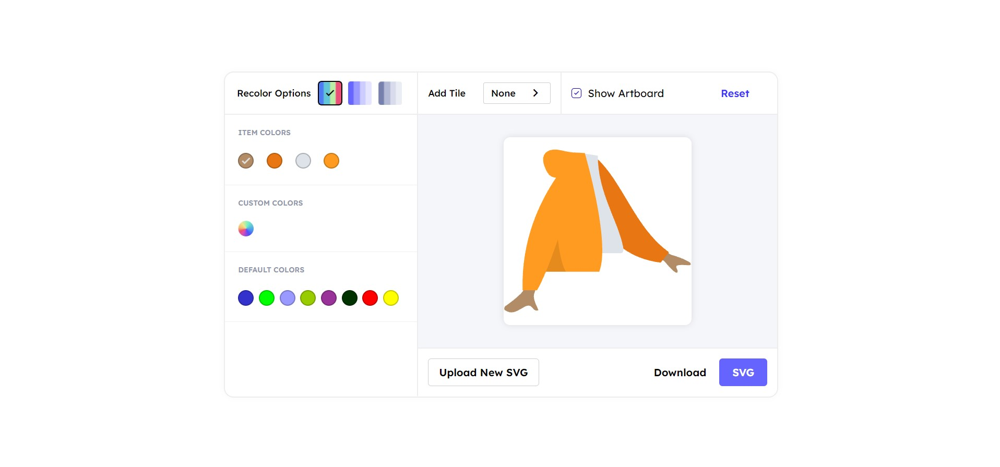

<div id="top"></div>

<br />
<div align="center">
  <h1 align="center">.svg editor</h1>

  <p align="center">
    Change colors - Add tiles - Modified your SVGs.
  </p>
</div>

## About The Project



I build svg editor with HTML, CSS and JavaScript. In which you can customise your SVG however you want.
<br>
you can also add different tile in background of svg.
<br/>
Like : Square, Squircle, Circle, Beacon

- you can also control their size, border radius and change colors.

<br/>
  It also has different color options :

- Monochrome : Saturation can be adjusted.
- Gray Scale : Gray tone can be adjusted.

After filling your svg with your talent you can download updated svg.

Here's why:

- to develop a better understanding of SVGs.
- as well as to learn how to modify svgs in HTML.

Use your creativity and color talent to make your SVG more attractive.

## Demo

Here is a quick demo of the app. I hope you enjoy it.

> [The Demo Link](https://naim30.github.io/svg-editor/)

## Built With

To build this Landing page I used..

- HTML
- CSS
- JAVASCRIPT

## Getting Started

you do not need any prerequisites for this project, just clone the repo and open `index.html` in browser.

Clone the repo

```sh
git clone https://github.com/naim30/svg-editor.git
```

## Changelog

### v1.0.0 :

### Added or Changed

- change colors from item color menu.
- monochrome and gray scale color filter.
- background tiles.

### v2.0.0 :

### Added or Changed

- you can select color by clicking on svg element.

## Contact

Naimish Lukhi :
Email - naimlukhi30@gmail.com :
[LinkedIn](https://www.linkedin.com/in/naimish-lukhi-a2b14a1b9)

Project Link: [https://github.com/naim30/svg-editor](https://github.com/naim30/svg-editor)

<p align="right">(<a href="#top">back to top</a>)</p>
